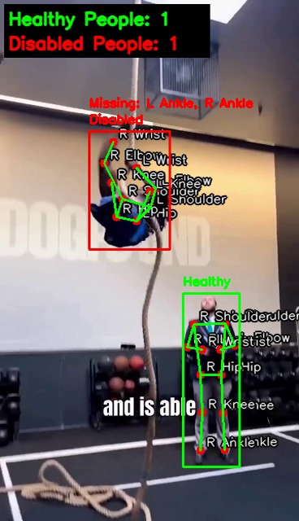
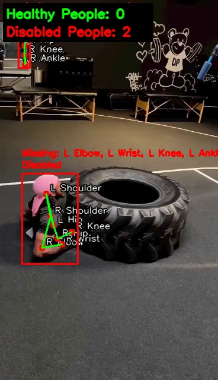
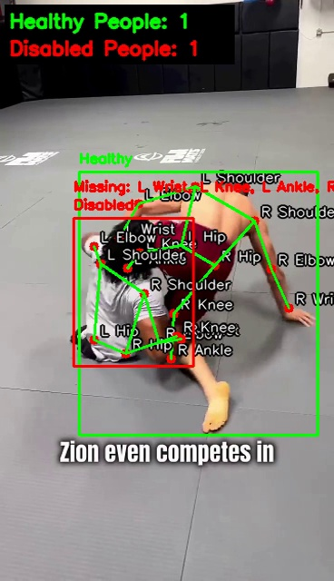
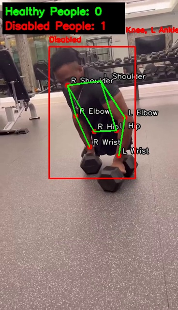

# 🧘‍♂️ YOLOv11 Pose Integrity & Status Detector


A real-time computer vision application that utilizes **YOLOv11-Pose** to detect human keypoints and analyze physical integrity. The system classifies individuals as **"Healthy"** or **"Disabled"** based on the visibility and confidence of specific anatomical joints.

---

## 📸 Visual Demo

Below are actual output frames generated by the system. The overlay displays the skeleton, the classification status ("Healthy" vs "Disabled"), and lists any undetected joints.

<p align="center">
  
  
</p>
<p align="center">
  
  
</p>

---

## 📝 Table of Contents
- [Features](#-features)
- [How It Works](#-how-it-works)
- [Project Structure](#-project-structure)
- [Installation](#-installation)
- [Usage](#-usage)
- [Configuration](#-configuration)
- [Output](#-output)

---

## ✨ Features

* **Advanced Pose Estimation:** Uses the state-of-the-art `yolov11x-pose` model for high-accuracy keypoint detection.
* **Integrity Analysis:** Automatically detects low-confidence keypoints to identify potential "missing" limbs.
* **Dynamic Visualizations:**
    * Draws full body skeletons.
    * Highlights "Healthy" individuals in **Green** and "Disabled" in **Red**.
    * Lists specific missing body parts (e.g., "Missing: L Wrist").
* **Real-time Dashboard:** Displays a live counter of Healthy vs. Disabled individuals on-screen.
* **Video Export:** Automatically saves the analyzed footage to `.mp4`.

---

## 🧠 How It Works

The script processes video frames and utilizes a confidence threshold to determine the status of a person:

1.  **Detection:** The model scans for 12 specific joints: Shoulders, Elbows, Wrists, Hips, Knees, and Ankles.
2.  **Thresholding:** It checks the confidence score (`conf`) of each keypoint.
    * **Threshold:** `0.7` (70%)
3.  **Classification:**
    * **Healthy:** All monitored joints are detected with confidence > 0.7.
    * **Disabled:** One or more joints fall below the threshold. The specific missing joint is logged and displayed above the bounding box.

---

## ⚠️ Limitations

Please note that this is a proof-of-concept using raw confidence thresholds. **The model currently struggles to distinguish between actual amputation and temporary occlusion.**

* **Occlusion vs. Amputation:** If a healthy person puts their hand in their pocket, hides it behind their back, or stands behind an object, the YOLO model's confidence for that keypoint will drop below 0.7.
* **False Positives:** Consequently, healthy individuals are often misclassified as "Disabled" during complex movements or when limbs are obscured from the camera's view.

Future improvements could involve temporal tracking (remembering a limb existed in previous frames) to reduce these false positives.

---

## 📂 Project Structure

The script utilizes the `output` folder to store both the video and the demo frames shown above.

```text
📦 YOLO-Pose-Project
 ┣ 📂 dataset
 ┃ ┗ 📜 05.mp4                # Source video
 ┣ 📂 output
 ┃ ┣ 📜 demo_frame.jpg        # Generated snapshots used in README
 ┃ ┣ 📜 demo_frame01.jpg
 ┃ ┣ 📜 demo_frame02.jpg
 ┃ ┣ 📜 demo_frame03.jpg
 ┃ ┗ 📜 yolov11_pose_estimator_detected.mp4
 ┣ 📜 yolo11x-pose.pt         # Model weights
 ┗ 📜 main.py                 # The analysis script
